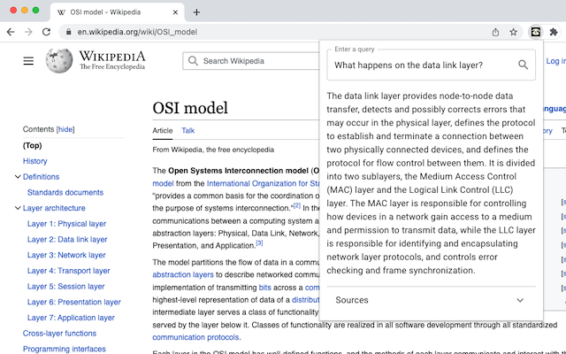

# Sloth Search

A browser extension that provides AI-powered semantic search over web pages.

## About

Sloth Search answers your queries based on the content of the page you are on. It extracts text from the page, identifies the relevant snippets via text embeddings, and formats an answer using an LLM. It also provides the sources used to generate the answer, so you can easily verify that the answer is accurate to the page content. It is particularly useful for text-heavy websites such as Wikipedia. See the following example.

_Note: this extension is currently a minimal prototype. There are many cool features to add!_

## Compatibility

This extension is compatible with the following browsers:

- [Google Chrome](https://www.google.com/intl/en_uk/chrome/)

## Installation

### Install from browser web store

- [Google Chrome Web Store](https://chrome.google.com/webstore/detail/sloth-search/jinbbhdfmkgebhbekpoaignaeclflibd)

### Install from release

- Download the desired release from the [releases page](https://github.com/Michael-JB/sloth-search/releases)
- Unzip the archive and load the resulting directory in your browser

### Build from source

- Install dependencies: `npm install`
- Generate a production build in the `dist` directory: `npm run build`
- Load the `dist` directory in your browser

## Development

Type checking, linting and other checks run as pre-commit hooks. You can also run them manually.

### Type checking

To run TypeScript type checking, run `npm run typecheck`. To run this while you make changes, run `npm run typewatch`.

### Linting

The project is configured to use ESLint with recommended configurations. Run linting with `npm run lint`.

## Future plans

This extension is still early in its development. These are some features and improvements that I would like to add in the future:

- _User sessions._ A user would be able to start a session to index multiple pages. Queries would then be evaluated over the resulting index.
- _Text highlighting._ At the moment, the extension only exposes a QA-style interface with citations. It would be cool if it highlighted relevant text on the page.
- _Support other document formats._ (e.g., PDFs).
- _Improved HTML text scraping._ At the moment, the text extraction is quite rudimentary and the indexed data is of a low quality. It would be great to improve this.
- _Back it with a server._ At the moment, users have to enter their own API keys. The resulting annoyance to the user is exaggerated by the inability to persist keys between browser sessions for security reasons.
- _Custom prompt._ At the moment, it uses the stock langchain QA retrieval chain. Though this already works well, tuning the prompt and vector querying will give better results.

## Built with

- [OpenAI](https://openai.com/) - LLM completion and embeddings APIs
- [LangChain](https://js.langchain.com/) - Vector database and LLM framework
- [React](https://react.dev/) - UI library
- [TypeScript](https://www.typescriptlang.org/) - Typing for JavaScript
- [Vite](https://vitejs.dev/) - Build system (mostly used for pre-configured [Rollup](https://rollupjs.org/))
- [Material UI](https://mui.com/) - React component library
- [npm](https://www.npmjs.com/) - JavaScript dependency management
- [nano-react-app](https://github.com/nano-react-app/nano-react-app) - Project bootstrap, because `create-react-app` is too bloated

## License

[MIT license](./LICENSE)
